# Rumah Maguwoharjo (Seputaran Krodan)

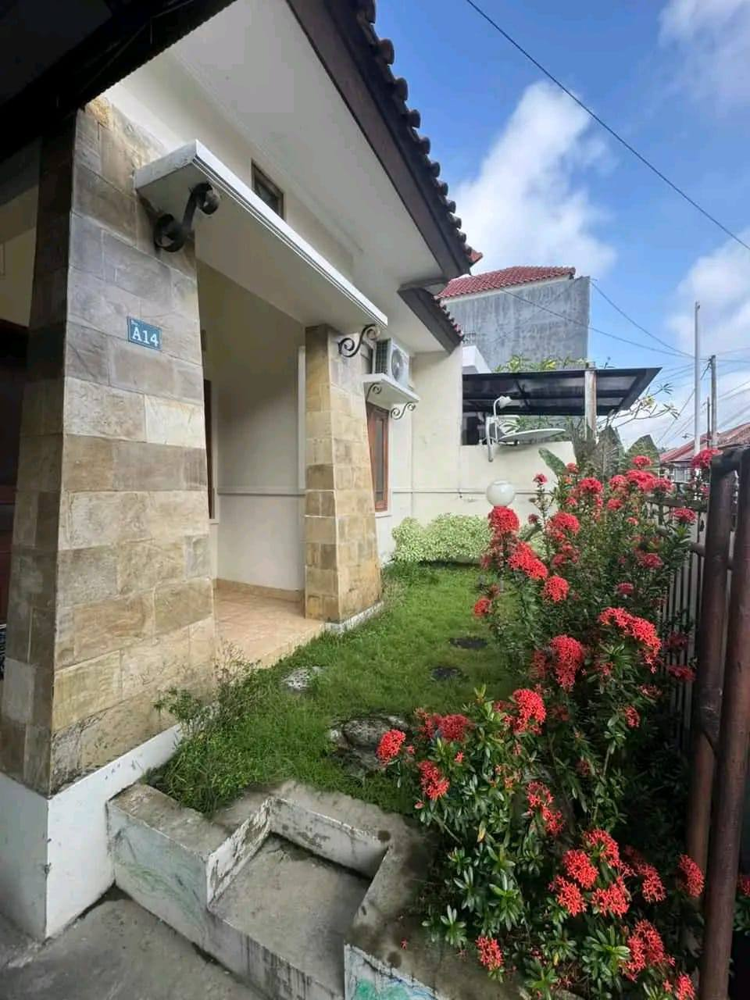

- **Harga:** Rp 28.000.000 / tahun (Nego)
- **Lokasi:** Perum Seputaran Krodan, Maguwoharjo, Depok, Sleman
- **Kontak:** WA [0895-4049-49149](https://wa.me/62895404949149) (Sumber: Facebook)

## Galeri Foto

| Area | Foto |
|------|------|
| **Fasad / Tampak Depan** | 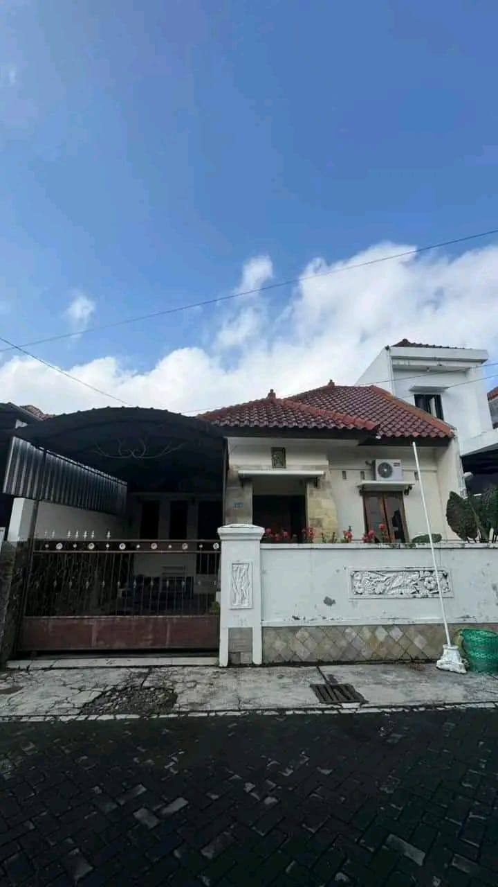 |
| **Jalan & Taman Depan** | 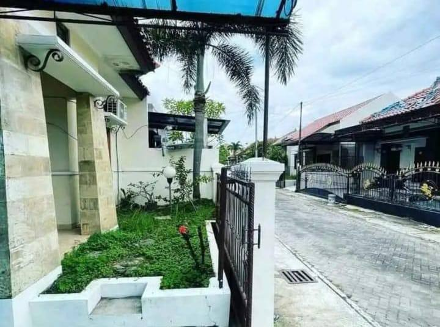   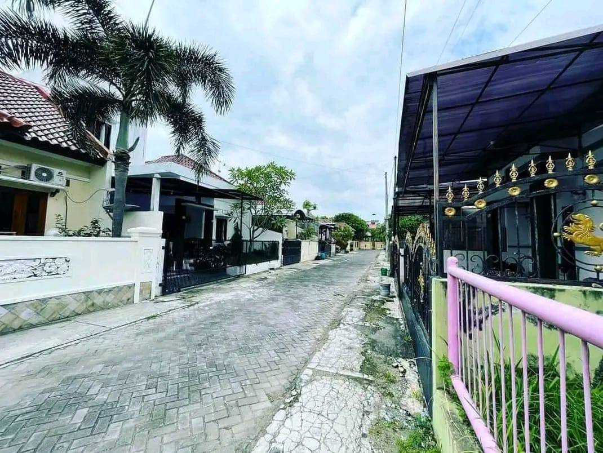 |
| **Gerbang Depan (E2)** | 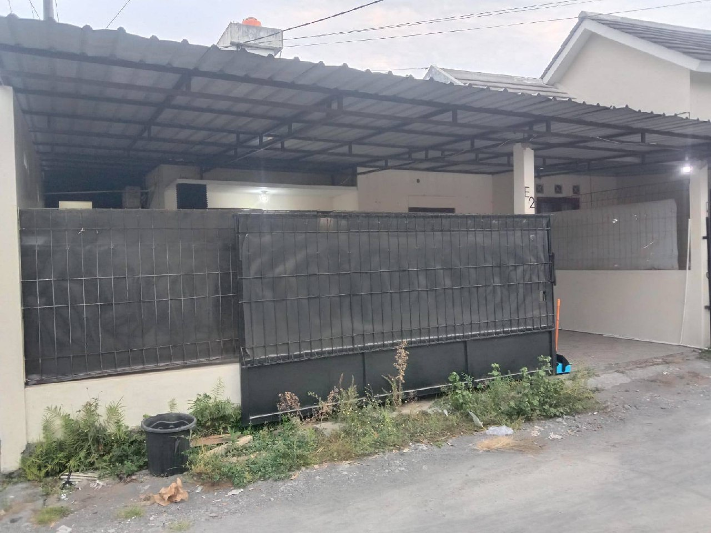 |
| **Ruang Tamu / Tengah** | 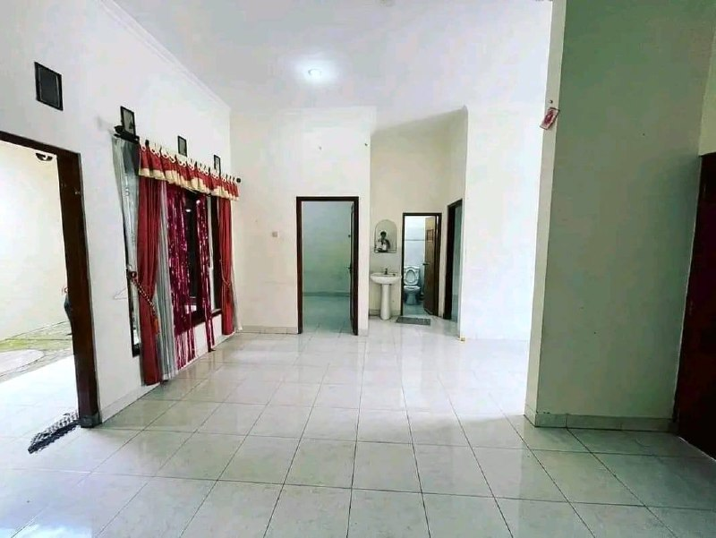   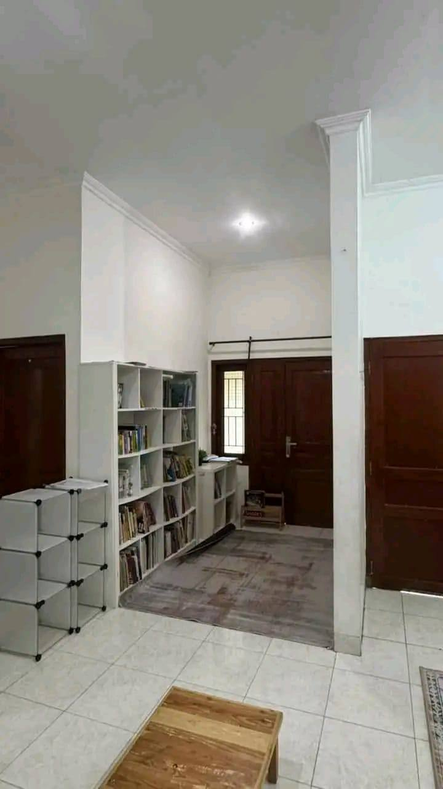 |
| **Kamar Tidur (Ber-AC)** | 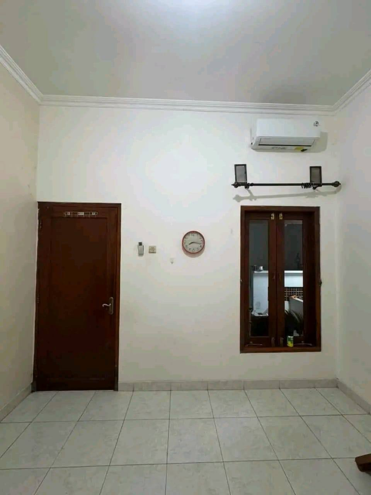   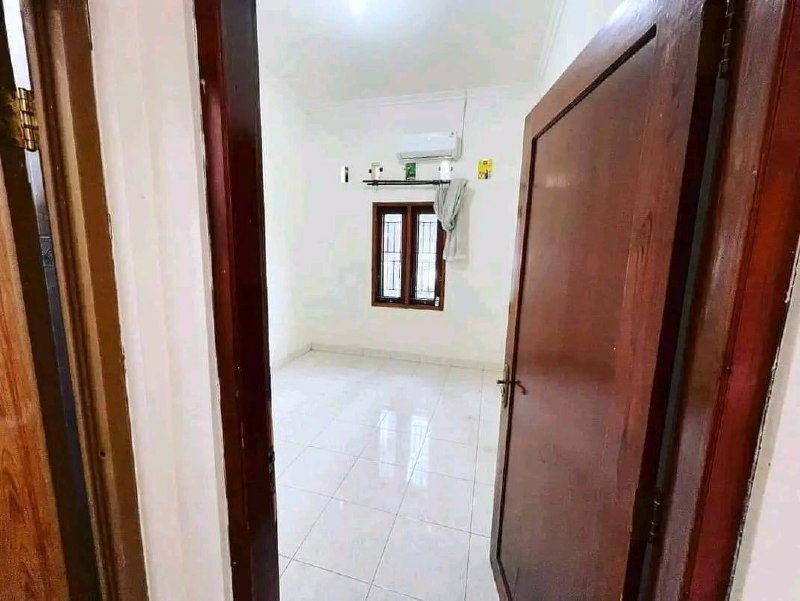 |
| **Dapur & Area Belakang**| 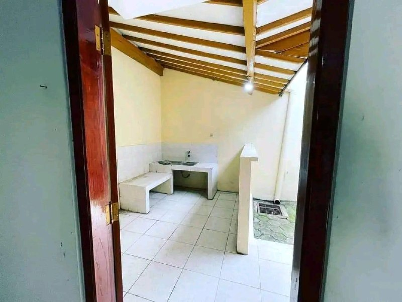   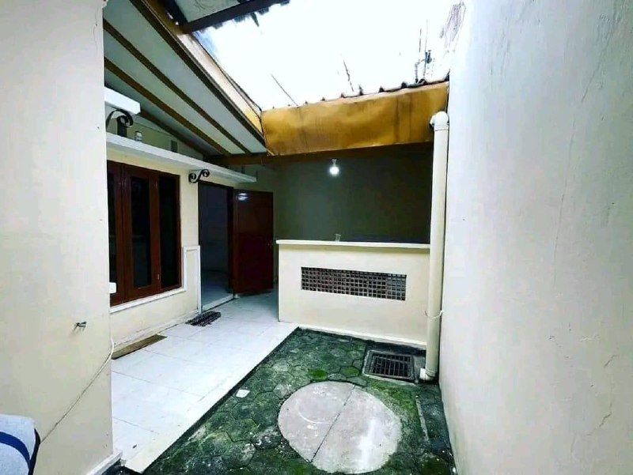 |

## Fasilitas
- 2 Kamar Tidur (dapat 2 unit AC)
- 1 Kamar Mandi (Kloset Duduk)
- Ruang Tamu & Ruang Keluarga
- Dapur
- Taman Depan dan Belakang (Inner Courtyard kecil di belakang)
- Carport Mobil (Berpagar besi)
- Listrik 1300 Watt
- Air Sumur (Pompa/Sanyo)

## Poin Plus (Pros)
- **Kondisi Dalam:** Cukup rapi, lantai granit/keramik putih bersih, ada gorden mewah bawaan di ruang tamu.
- **Sirkulasi/Cahaya:** Ada area terbuka kecil di belakang (courtyard) buat jemuran/sirkulasi udara, plus dapur dengan wastafel cor/keramik.
- **Lingkungan:** Dalam perumahan, jalan conblock rapi, asri (banyak tanaman), warga nasionalis, akses mudah.
- **Keamanan:** Security 24 jam.
- **Lokasi Sangat Strategis:** Dekat Instiper, RS Hermina, Sanata Dharma, Gistrav Schools 3, UPN, Respati, UII Ekonomi, RS JIH, Amikom, dan Pakuwon Mall.
- **Value:** Sudah include 2 AC terpasang (lihat di foto kamar dan fasad depan), lumayan menghemat biaya beli/pasang AC sendiri.

## Poin Minus (Cons)
- **Tampilan Luar:** Beberapa bagian fasad/kanopi depan agak kurang terawat (ada lumut di saluran air, rumput liar di depan pagar geser hitam, kanopi agak redup).
- Harga awal (28 Juta) sedikit di atas budget target (~25 Juta). Tapi karena statusnya nego, peluang untuk turun mendekati budget masih sangat terbuka.

---
*Diinput berdasarkan data Facebook & Analisis Foto Internal*