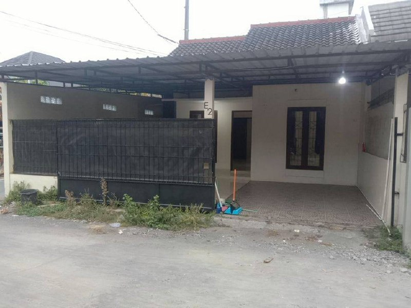
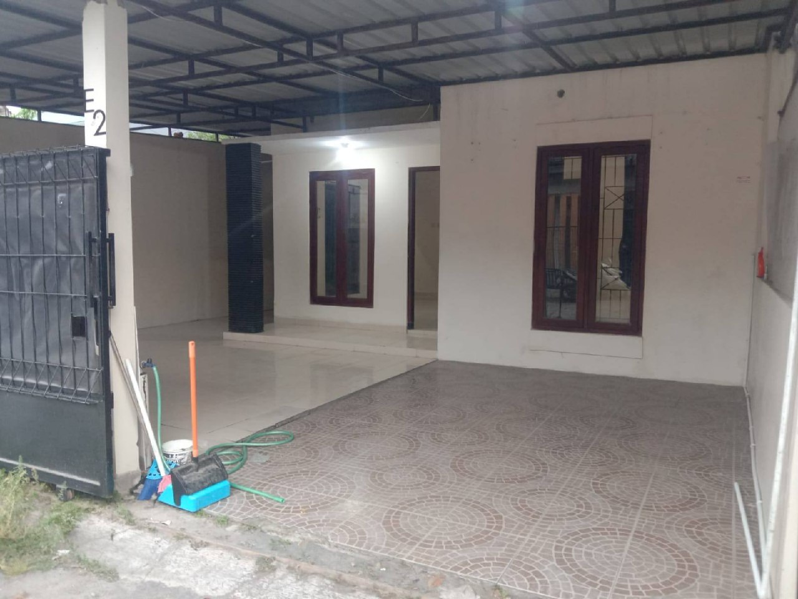
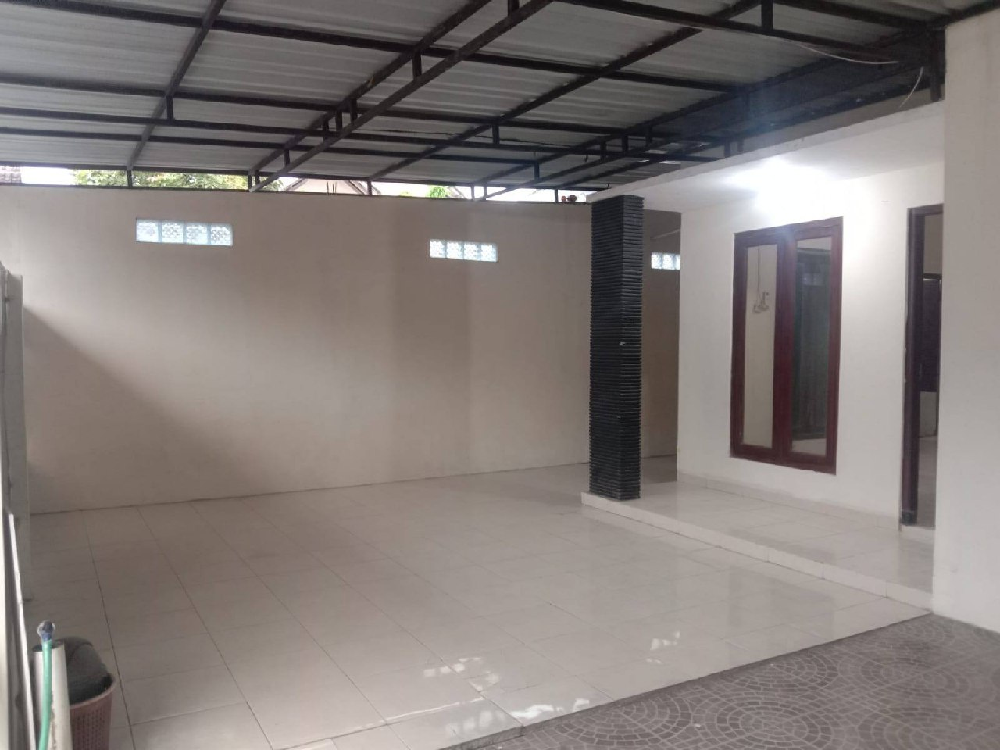
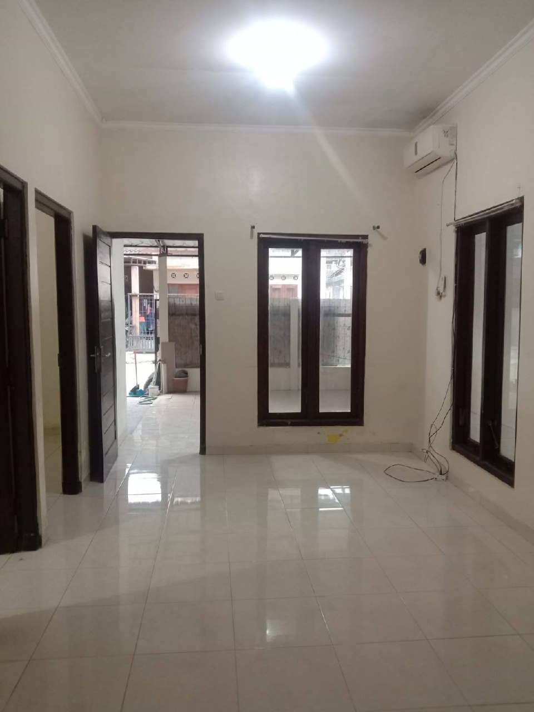
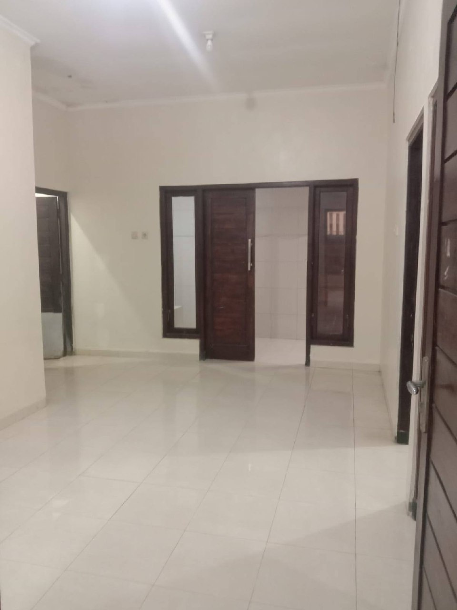
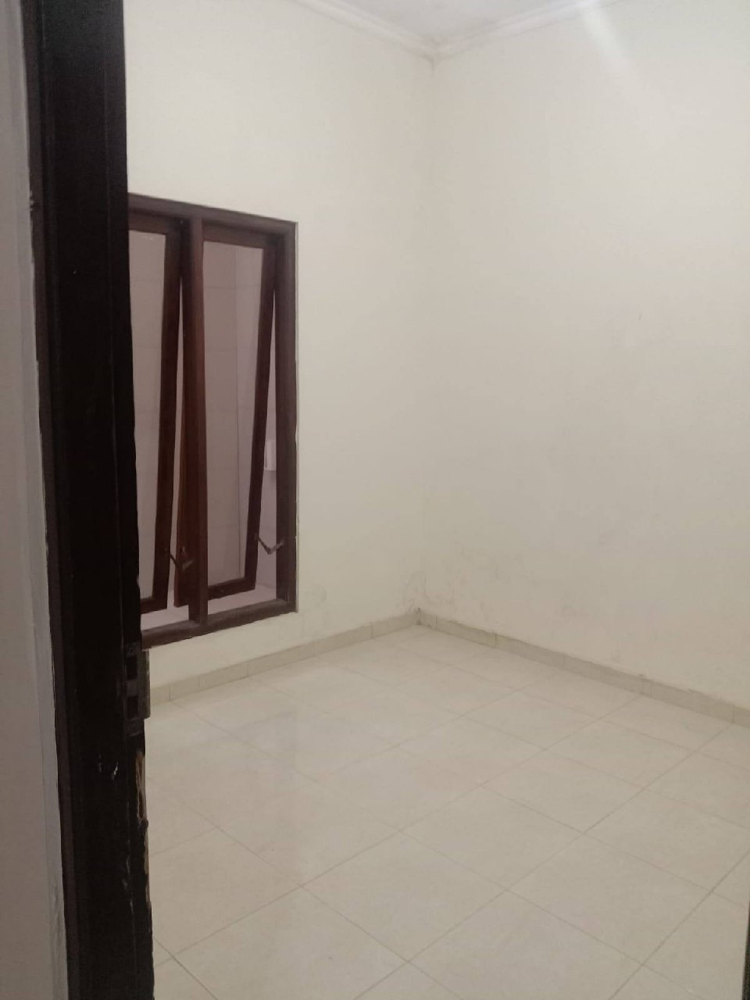
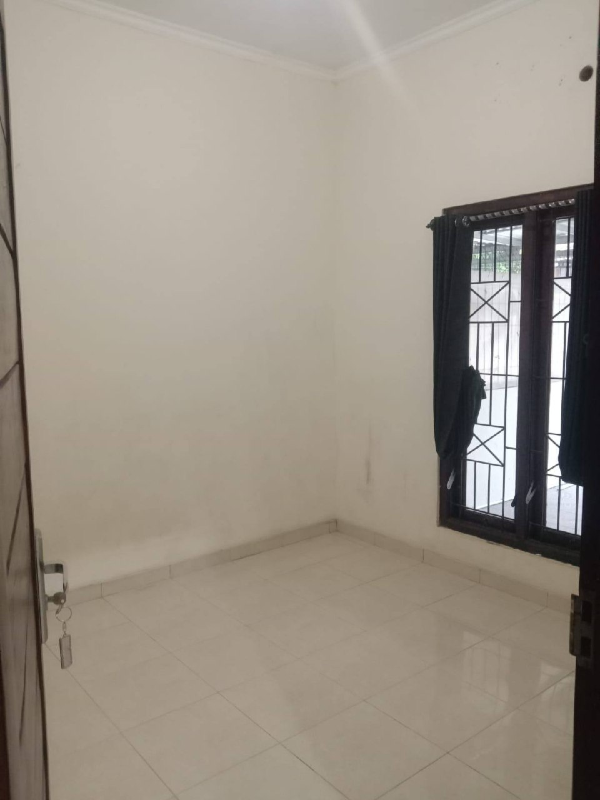
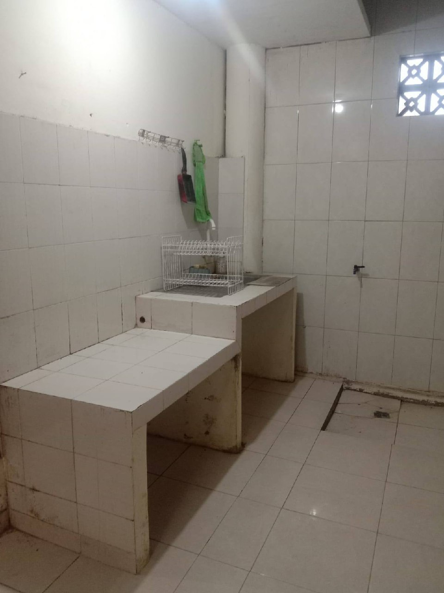
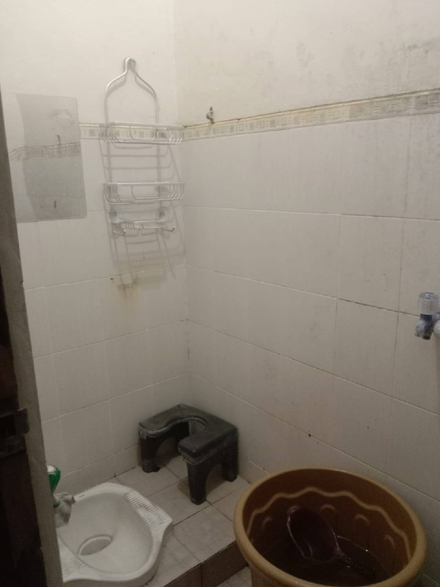
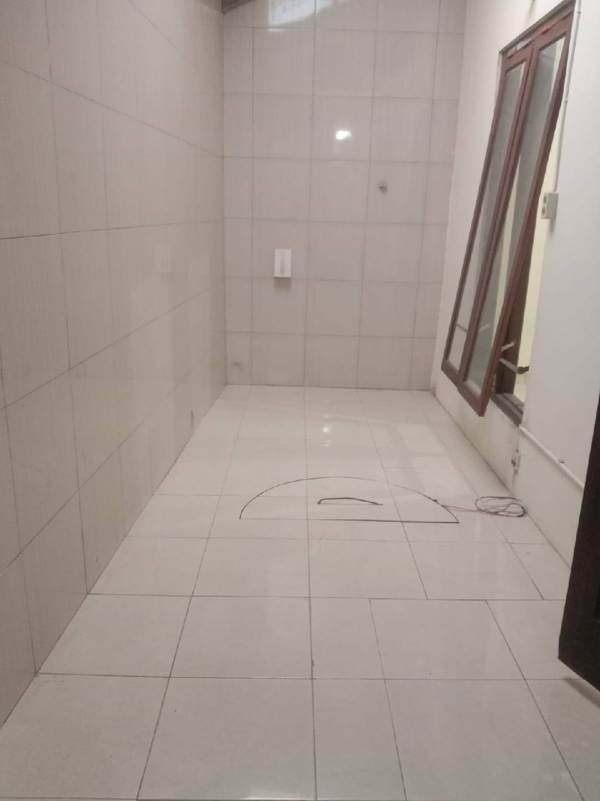

# Rumah Jalan Palagan Km 7,5 (Jongke)

- **Harga:** Rp 25.000.000 / tahun (Nego)
- **Lokasi:** Seputaran Jl Palagan km 7,5 / Barat Hotel Hyatt, Jongke, Sendangadi, Mlati, Sleman
- **Kontak:** WA [0895-4049-49149](https://wa.me/62895404949149) (Sumber: Facebook)

## Galeri Foto

| Area | Foto |
|------|------|
| **Carport & Fasad Depan** |     |
| **Area Teras Dalam** |  |
| **Ruang Tengah/Hallway** |     |
| **Kamar Kosong** |     |
| **Dapur & Toilet** |        |

## Fasilitas
- 2 Kamar Tidur
- 1 Kamar Mandi (Kloset Jongkok, ada modifikasi kursi duduk)
- Ruang Tamu Luas (include 1 unit AC)
- Dapur (Kondisi keramik standar)
- Carport (Muat 2 Mobil, Berpagar hitam tertutup plat, Atap Seng/Spandek)
- Listrik 1300 Watt
- Air Sumur (Pompa/Sanyo)

## Poin Plus (Pros)
- **Harga:** Pas dengan target budget awal (~25 Juta), apalagi masih bisa nego, jadi berpeluang deal di bawah budget.
- **Kondisi Dalam Utama:** Lantai keramik/granit mengkilap (glossy) di ruang utama, warna kusen coklat/hitam modern, cat dinding putih mulus (kelihatan baru/habis direnov di area depan/tengah).
- **Lokasi Premium & Strategis:** Area Jl. Palagan / Hyatt itu sangat premium di Jogja Utara. Dekat dengan: Mall SCH (Sleman City Hall), Pemda Sleman, RS UGM, MMTC, UTY 1, Mall JCM (Jogja City Mall), UGM, Al Azhar, dan RS Sardjito.
- **Parkiran:** Carport sangat luas, muat sampai 2 mobil, berpagar geser hitam rapat (privasi terjaga), dan tertutup kanopi rapat.
- **Ruang Tamu:** Diklaim luas dan sudah terpasang AC.
- **Lingkungan:** Nyaman, nasionalis, akses mudah 24 jam.

## Poin Minus (Cons)
- **Kondisi Kamar Mandi:** Kamar mandi terlihat sangat kotor/berkerak (butuh deep cleaning ektra), kloset jongkok (meski diakali dengan kursi plastik duduk yang ditaruh di atasnya), pencahayaan kurang.
- **Dapur:** Meja dapur/sink cor keramiknya terlihat kotor berkerak di bagian bawah.
- **Kelembapan/Dinding:** Di salah satu kamar kosong, terlihat ada masalah rembesan air/kelembapan parah di dinding bagian bawah (cat mengelupas/berjamur coklat kehitaman). Ini *red flag* yang harus dicek langsung.
- **AC:** Hanya dapat 1 unit AC (di ruang tamu), tidak ada info AC di kamar tidur.
- **Kerapian Eksterior & Jalan:** Akses jalan depan rumah terlihat seperti tanah/makadam berdebu, depan pagar banyak rumput liar/kurang terawat. Sisa instalasi kabel AC di ruang tamu juga masih berantakan di lantai.
- **Cahaya Depan:** Teras carport agak redup karena tertutup kanopi full seng metalik.

---
*Diinput berdasarkan data Facebook & Analisis Foto Internal*