# Rumah Area Westlake (Barat Jombor)

- **Harga:** Rp 28.000.000 / tahun (Nego)
- **Lokasi:** Seputaran Resto Westlake / Barat Jombor, Sleman
- **Kontak:** WA [0895-4049-49149](https://wa.me/62895404949149) (Sumber: Facebook)

## Syarat Khusus
- **Wajib Muslim**

## Galeri Foto

| Area | Foto |
|------|------|
| **Fasad & Carport** | 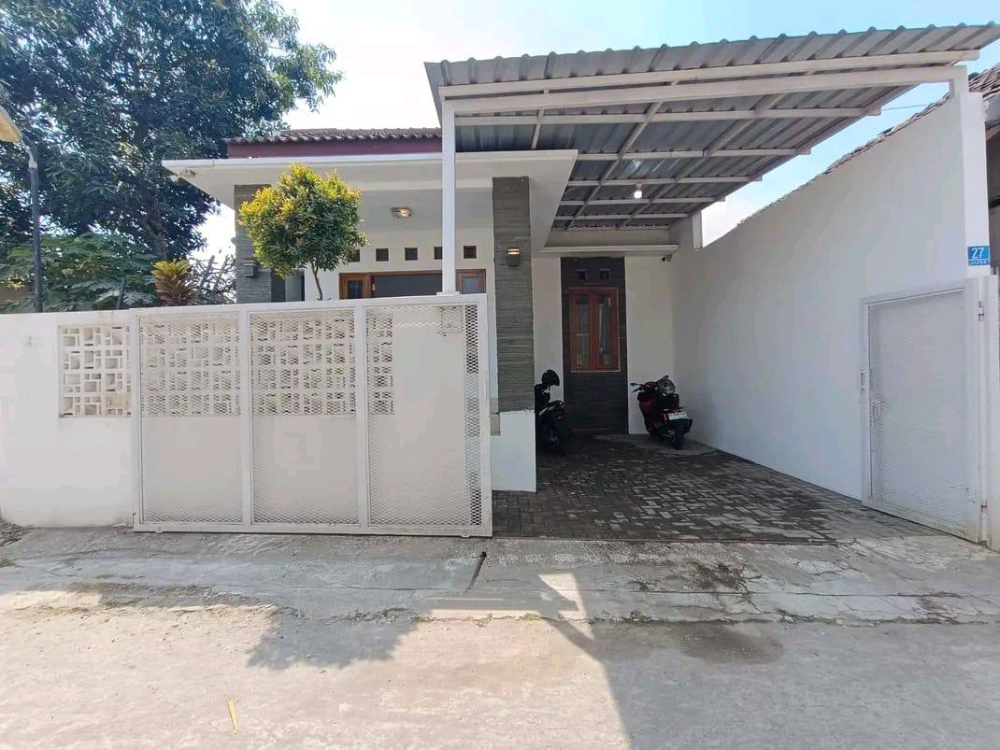   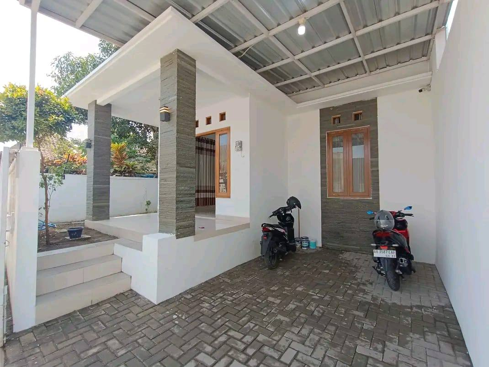   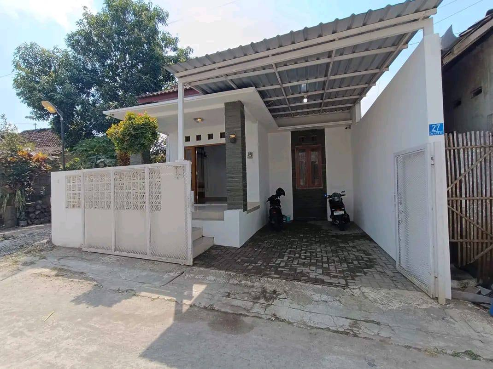 |
| **Lingkungan/Jalan** | 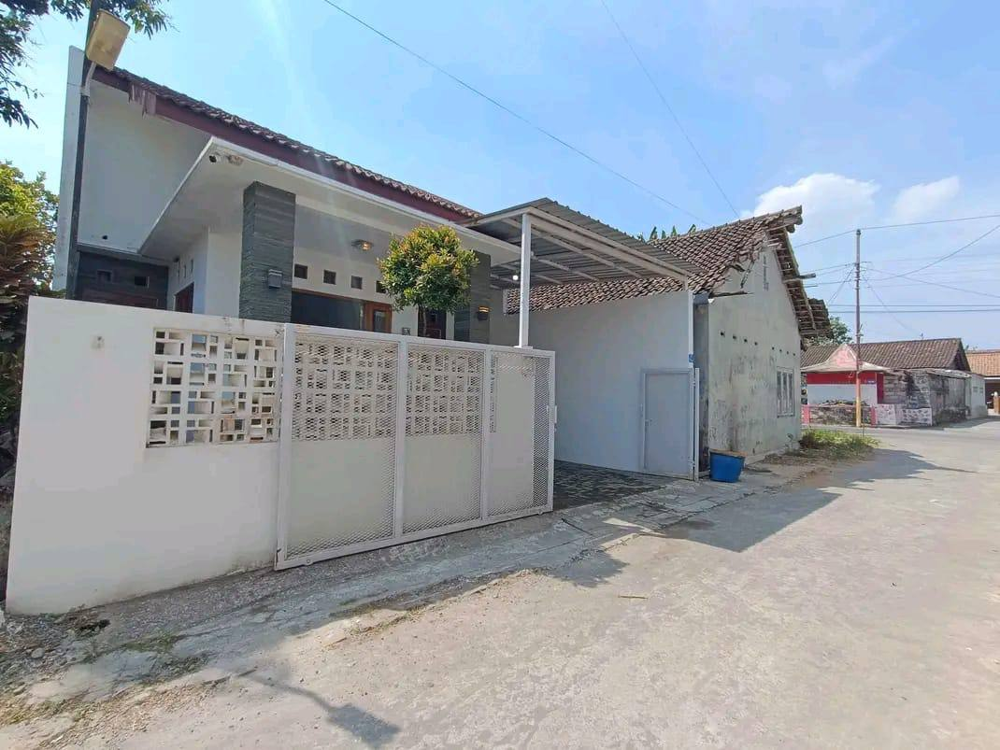 |
| **Ruang Tamu/Tengah** | 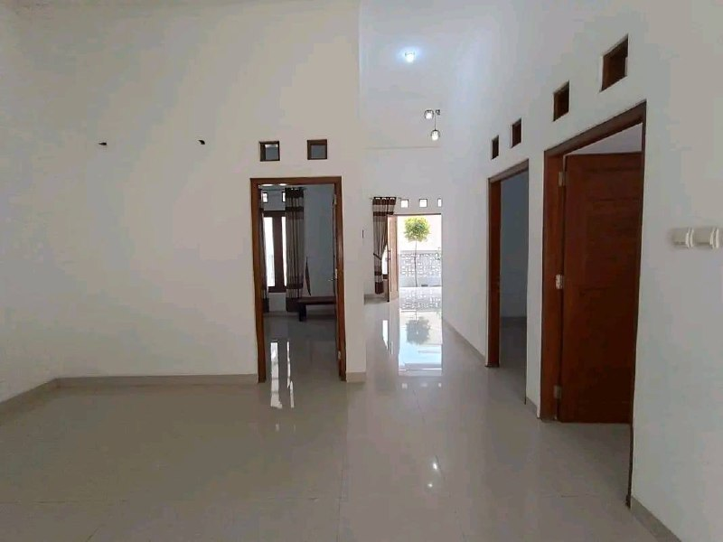   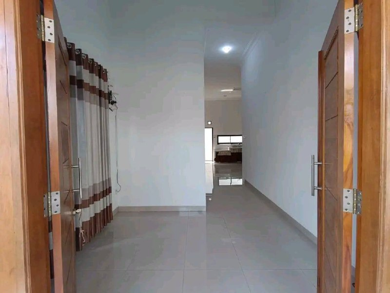   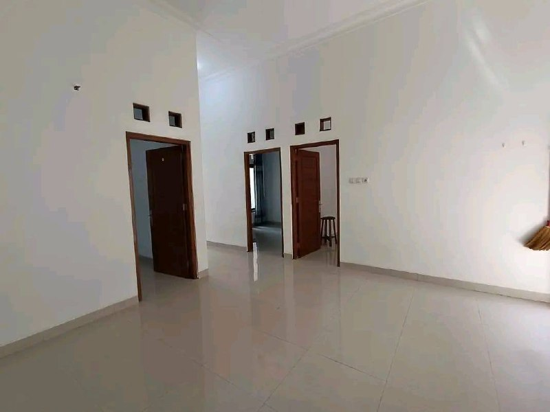 |
| **Dapur & Ruang Cuci** | 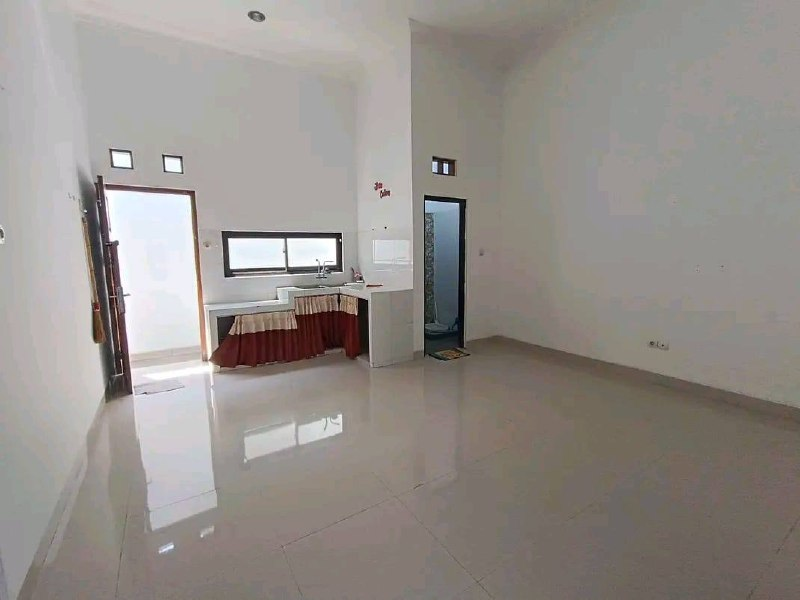   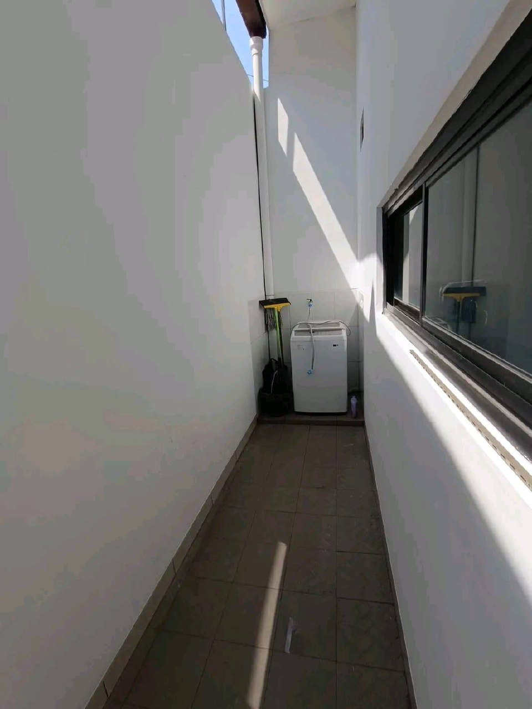   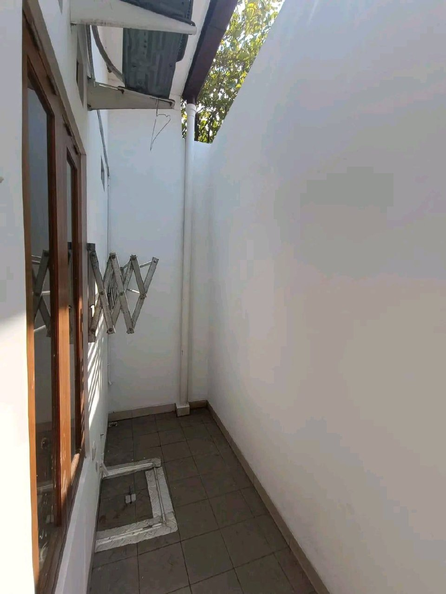 |
| **Kamar Tidur** | 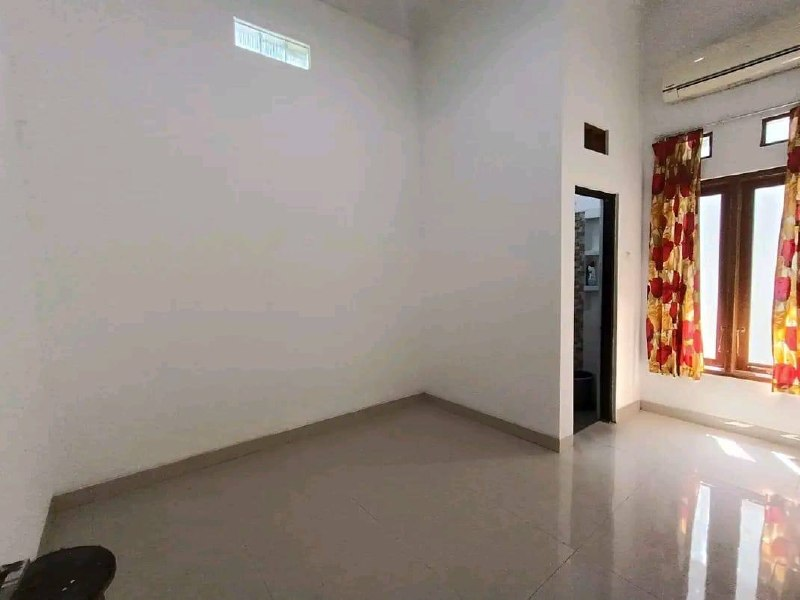   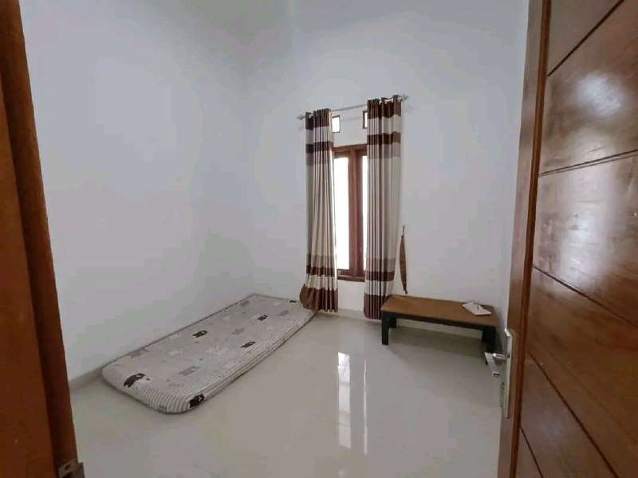   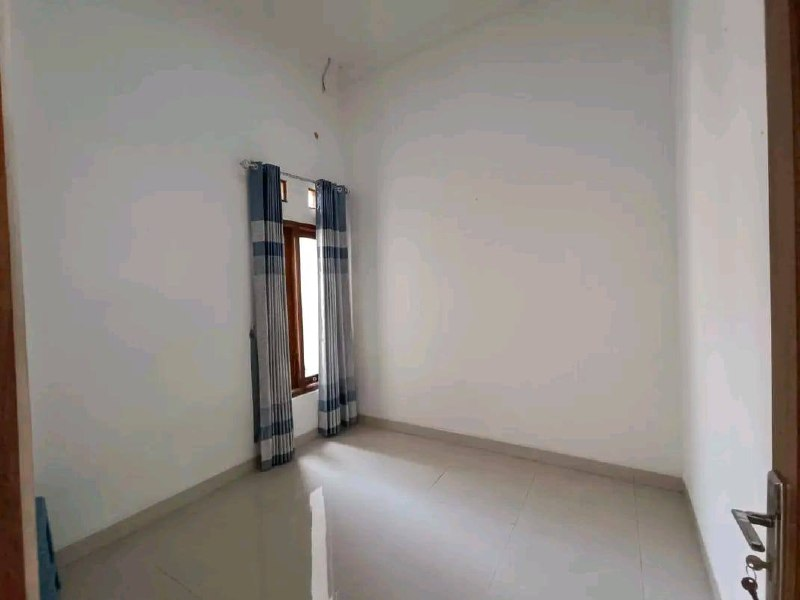 |
| **Kamar Mandi** | 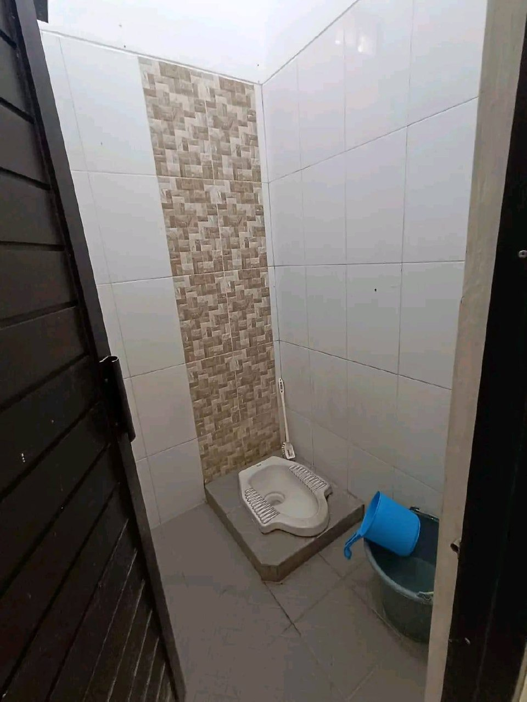   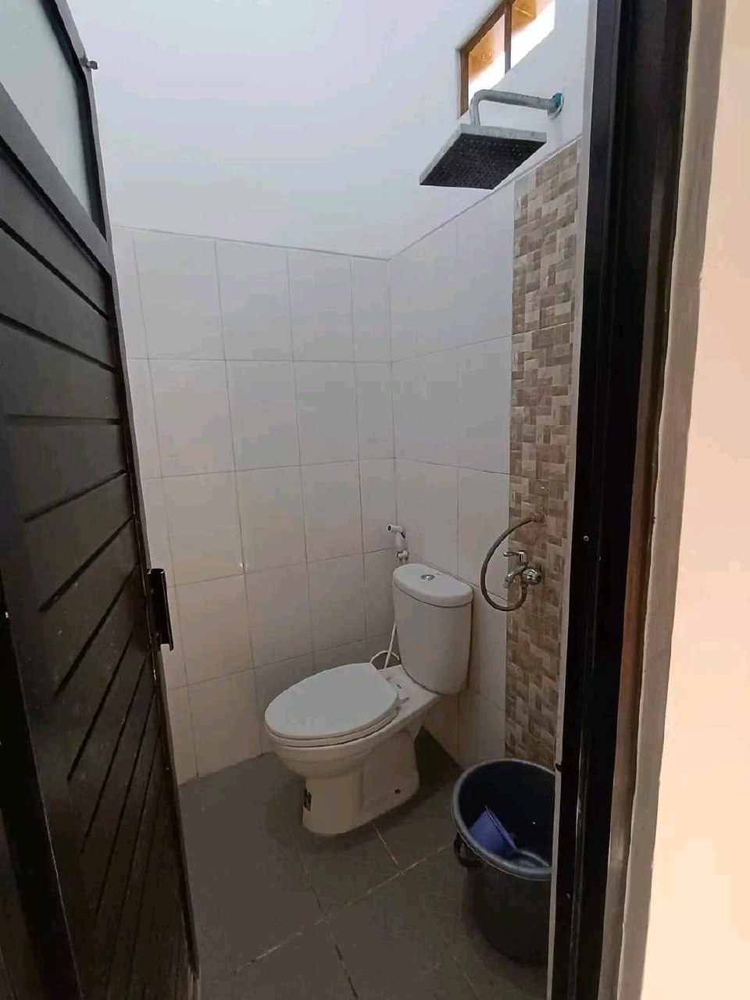 |
| **Bonus** | 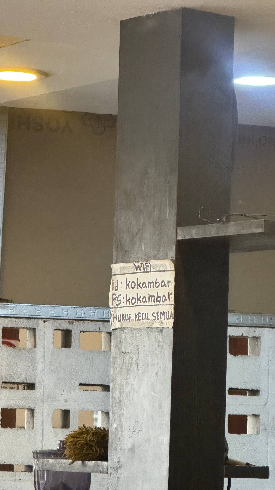 |

## Fasilitas
- 3 Kamar Tidur (dapat 1 unit AC di salah satu kamar)
- 2 Kamar Mandi (Keduanya Kloset Duduk & ada Shower/Bidet)
- Ruang Tamu & Ruang Keluarga (Luas)
- Dapur (Minimalis, Kitchen Sink Stainless, ada gorden kolong)
- Area Cuci/Jemur (Di belakang/samping, sudah ada rak jemuran tempel & colokan mesin cuci)
- Garasi/Carport Mobil (Atap spandek/seng, lantai conblock)
- Listrik 1300 Watt
- Air Sumur (Pompa/Sanyo)
- **CCTV** (Terlihat ada 1 unit di area carport luar)
- Bonus: Ada bekas stiker/kertas colokan WiFi ("kokambar") di pilar, mungkin ada tarikan kabel internet aktif.

## Poin Plus (Pros)
- **Kondisi Bangunan (SANGAT BAGUS):** Dari luar sampai dalam terlihat sangat modern, bersih, dan terang. Desain minimalis (putih, abu, batu alam, kayu). Sirkulasi udara & cahaya sangat dipikirkan (banyak jendela *transom* ventilasi kecil di atas pintu/jendela).
- **Kapasitas Lebih Besar:** Ada 3 Kamar Tidur dan 2 Kamar Mandi (paling luas dibanding opsi sebelumnya). Sangat lega.
- **Dapur & Laundry Area:** Dapurnya rapi dan terang. Area cucinya (*laundry area*) ada di lorong terbuka tapi aman (ada jemuran nempel dinding dan saluran air/keran untuk mesin cuci).
- **Kamar Mandi Premium:** Kedua kamar mandinya bersih, full keramik sampai atas, kloset duduk, shower, dan *bidet spray*.
- **Fasilitas Tambahan:** Ada CCTV di luar untuk ekstra keamanan.
- **Lokasi Strategis (Ringroad Barat/Utara):** Akses cepat ke Ringroad (Barat Jombor). Dekat Mall JCM, RS UGM, kampus MMTC, UTY 1, UNISA, RS Queen Latifa, area Cebongan, dan Al Azhar. Lingkungan jalannya rapi dan asri (jalan conblock lebar).

## Poin Minus (Cons)
- **Harga:** Harga awal 28 Juta masih di atas target (~25 Juta), mesti pinter-pinter nego.
- **Minim AC:** Cuma 1 AC untuk rumah seluas ini dengan 3 kamar.
- **Gorden:** Gorden bawaannya masih model lama (bercorak rame, bergaris-garis coklat tua) yang agak "nabrak" dengan desain rumah yang udah *clean & minimalist*.
- **Restriksi Profil:** Ada syarat khusus "Wajib Muslim" (pastikan sesuai profil).

---
*Diinput berdasarkan data Facebook & Analisis Detail Galeri Foto Internal*